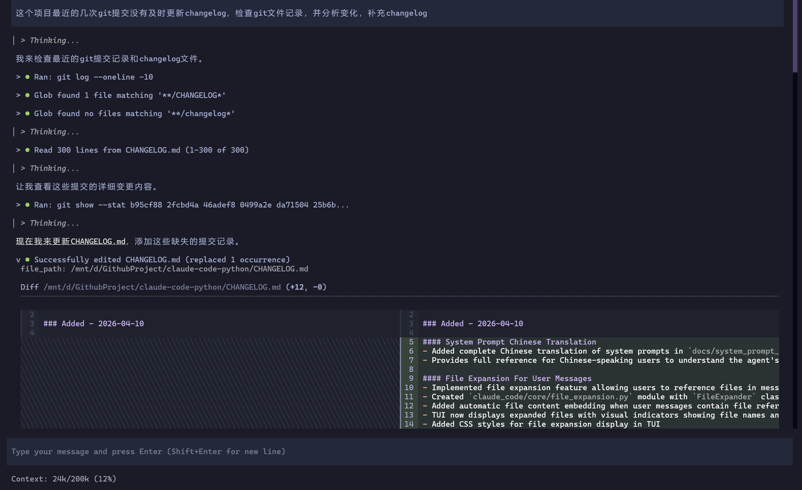
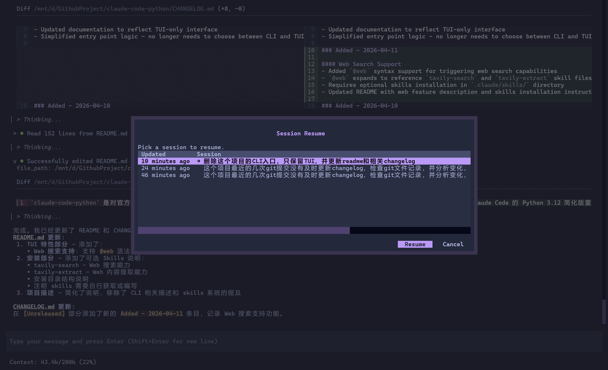
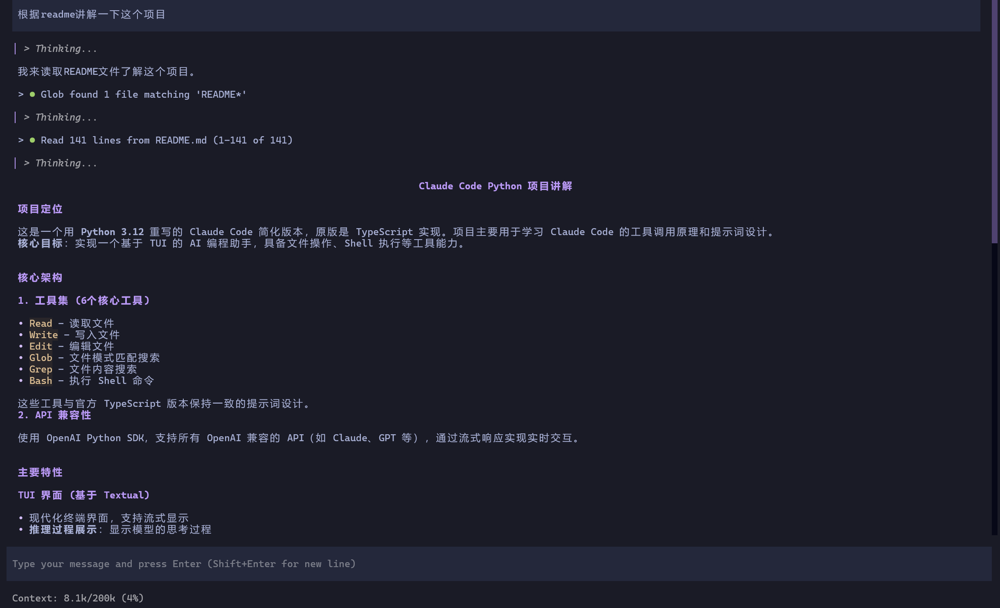

# Claude Code Python

> Code Author: GPT-5.4 & GLM-5 & Doubao-Seed-Code-2.0

> WARNING: 本项目绝大部分为AI生成代码

1. 此项目仅用于个人探究 Claude Code 基本工具调用原理、系统提示词、工具提示词设计，仅用于个人学习，不保证更新和维护。
2. 此项目的部分前端组件(例如代码diff view)参考了 [toad](https://github.com/batrachianai/toad)，也是一个Python AI TUI。

`claude-code-python` 是利用 AI 对官方 TypeScript 版 Claude Code 的 Python 简化版重写，当前聚焦核心 agent 能力：TUI 对话循环、OpenAI 兼容 `/v1/chat/completions`、基础文件与 shell 工具，以及与上游保持一致的提示词和交互语义，其他高级特性（例如skills系统或其他高级特性）暂不考虑。

<table>
  <tr>
    <td align="center"><b>欢迎界面</b></td>
    <td align="center"><b>Code Diff渲染</b></td>
  </tr>
  <tr>
    <td></td>
    <td></td>
  </tr>
  <tr>
    <td align="center"><b>Sessions 管理</b></td>
    <td align="center"><b>Markdown 渲染</b></td>
  </tr>
  <tr>
    <td></td>
    <td></td>
  </tr>
</table>

## Features

### 核心功能
- **TUI交互界面**：基于 Textual 的现代化终端用户界面
- **流式响应**：支持流式响应、工具调用、工具结果回填
- **OpenAI 兼容**：使用官方 OpenAI Python SDK，支持所有 OpenAI 兼容的 API
- **工具集**：`Read`、`Write`、`Edit`、`Glob`、`Grep`、`Bash`
- **系统提示词对齐**：与 TypeScript 版本保持一致的系统提示词和工具描述

### TUI 特性
- **推理/思考内容支持**：显示模型的推理过程
- **上下文使用提示**：TUI 输入框下方实时显示上下文占用情况（已用/总量/百分比）
- **内联 Diff 展示**：`Edit` 和 `Write` 工具结果以 diff 格式呈现
- **多行输入支持**：Enter 提交，Shift+Enter 换行
- **输入历史导航**：上下键导航历史输入，持久化到 `~/.claude-code-python/input_history.json`
- **文件引用扩展**：支持 `@file_path` 语法在消息中引用文件内容，自动展开并显示
- **Web 搜索支持**：支持 `@web` 语法触发 Web 搜索能力（需安装 tavily-search 和 tavily-extract skills）

### Session 管理
- **Session 持久化**：每次 TUI 对话自动分配唯一 session ID，持久化到 `~/.claude-code-python/sessions/`
- **Session 恢复**：通过 `--resume <session_id>` 或 `--sessions` 选择恢复历史会话
- **Session 切换**：TUI 内使用 `/sessions` 命令切换到其他保存的会话
- **新建 Session**：TUI 内使用 `/clear` 命令开始新会话，无需重启应用

## 安装

要求：

- MacOS / Linux / Windows(仅支持WSL启动)
- Python 3.14+，推荐使用pyenv安装
- **ripgrep (rg)** - Grep 工具依赖

> WSL下需要  export COLORTERM=truecolor，否则配色不正常

### 安装 ripgrep

Grep 工具依赖系统安装的 `ripgrep` 命令行工具。请根据你的操作系统安装：

```bash
# macos
brew install ripgrep
# ubuntu
sudo apt-get install ripgrep
```

### 安装 claude-code-python

```bash
cd claude-code-python
pip install -e .
```

## 配置

推荐在仓库根目录创建 `.env`：

```env
CLAUDE_CODE_API_URL=https://api.openai.com/v1
CLAUDE_CODE_API_KEY=your-api-key
CLAUDE_CODE_MODEL=gpt-4.1
CLAUDE_CODE_MAX_CONTEXT_TOKENS=128000
```

`CLAUDE_CODE_MAX_CONTEXT_TOKENS` 用于 TUI 输入框下方的上下文占用提示行，显示当前已用上下文 token 数 / 模型总上下文 token 数 / 百分比。这个值不会自动推断，需按你实际使用的模型在 `.env` 中显式填写。

## 运行

启动 TUI：

```bash
claude-code-python
```

或使用简写：

```bash
cc-py
```

### 可选 Skills

如需使用 `@web` Web 搜索功能，需安装以下 skills：

1. **tavily-search** - Web 搜索能力
2. **tavily-extract** - Web 内容提取能力

安装方式：在项目根目录创建 `.claude/skills/` 目录，并将 skill 文件放入其中：

```
.claude/
└── skills/
    ├── tavily-search/
    │   └── SKILL.md
    └── tavily-extract/
        └── SKILL.md
```

> 注：skills 需要自行获取或编写，本项目不包含这些文件。

> 注意:本项目不支持skills系统，web功能通过解析固定路径 tavily-search 和 tavily-extract skills的SKILLS.md文件，附加到输入消息中实现）

## sessions系统

启动时选择已有 session：

```bash
claude-code-python --sessions
```

恢复指定 session：

```bash
claude-code-python --resume <session_id>
```

Session 说明：

- `claude-code-python`（或 `cc-py`）默认新开一个 session。
- session 标题默认取首条用户消息的第一句。

## 调试

开启调试日志：

```bash
claude-code-python --debug
```

如果同时指定了 `--log-file`，调试日志会写到指定路径；否则会自动写到当前目录下的 `.logs/claude-code-debug-<timestamp>.log`。


## 许可证

MIT License
