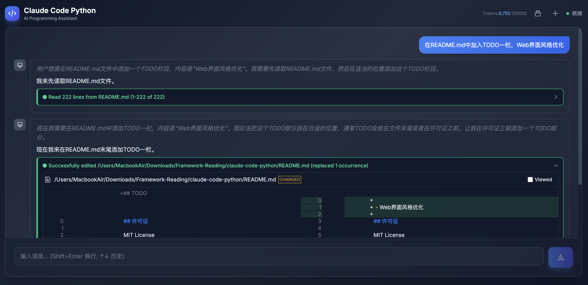

# Claude Code Python

> Code Author: GPT-5.4 & GLM-5 & Doubao-Seed-Code-2.0

> WARNING: 本项目绝大部分为AI生成代码

1. 此项目仅用于个人探究 Claude Code 基本工具调用原理、系统提示词、工具提示词设计，仅用于个人学习，不保证更新和维护。
2. 此项目的部分前端组件(例如代码diff view)来源于 [toad](https://github.com/batrachianai/toad)，也是一个Python AI TUI。

`claude-code-python` 是根据 Claude Code 提示词构建的 Python AI 编程终端，当前聚焦核心 agent 能力：Agent核心循环、OpenAI 兼容 `/v1/chat/completions`、基础文件与 shell 工具，以及与上游保持一致的提示词和交互语义，其他高级特性（例如skills系统或其他高级特性）暂不考虑。


<table>
  <tr>
    <td align="center"><b>欢迎界面</b></td>
    <td align="center"><b>Code Diff渲染</b></td>
  </tr>
  <tr>
    <td></td>
    <td></td>
  </tr>
  <tr>
    <td align="center"><b>Sessions 管理</b></td>
    <td align="center"><b>Markdown 渲染</b></td>
  </tr>
  <tr>
    <td></td>
    <td></td>
  </tr>
</table>

## Features

### 核心功能
- **TUI交互界面**：基于 Textual 的现代化终端用户界面
- **流式响应**：支持流式响应、工具调用、工具结果回填
- **OpenAI 兼容**：使用官方 OpenAI Python SDK，支持所有 OpenAI 兼容的 API
- **工具集**：`Read`、`Write`、`Edit`、`Glob`、`Grep`、`Bash`
- **系统提示词对齐**：与 TypeScript 版本保持一致的系统提示词和工具描述
- **HTTP 前后端统一**：`cc-api` 同时提供 API 和浏览器界面，`cc-py` 通过 HTTP 连接

### TUI 特性
- **推理/思考内容支持**：显示模型的推理过程
- **上下文使用提示**：TUI 输入框下方实时显示上下文占用情况（已用/总量/百分比）
- **内联 Diff 展示**：`Edit` 和 `Write` 工具结果以 diff 格式呈现
- **多行输入支持**：Enter 提交，Shift+Enter 换行
- **输入历史导航**：上下键导航历史输入，持久化到 `~/.claude-code-python/input_history.json`
- **文件引用扩展**：支持 `@file_path` 语法在消息中引用文件内容，自动展开并显示
- **@web 搜索**：支持 `@web` 语法触发 Web 搜索能力（需配置 tavily skills，详见下方说明）

### 浏览器界面特性 (实验)
- **现代化浏览器界面**：由 `cc-api` 提供的 Vue + FastAPI 响应式界面
- **Markdown 渲染**：支持完整的 Markdown 语法渲染，代码高亮显示
- **流式响应**：实时显示 AI 响应流，支持流式输出
- **会话管理**：创建、切换、恢复历史会话，会话持久化存储
- **工具调用可视化**：清晰展示工具调用过程和结果
- **Diff 内容渲染**：`Edit` 和 `Write` 工具结果以 diff 格式呈现，直观显示文件变更

<p align="center">
  
</p>

### TUI Session 管理
- **Session 持久化**：每次 TUI 对话自动分配唯一 session ID，持久化到 `~/.claude-code-python/sessions/`
- **Session 恢复**：通过 `--resume <session_id>` 或 `--sessions` 选择恢复历史会话
- **Session 切换**：TUI 内使用 `/sessions` 命令切换到其他保存的会话
- **新建 Session**：TUI 内使用 `/clear` 命令开始新会话，无需重启应用

## 安装

要求：

- MacOS / Linux / Windows(仅支持WSL启动)
- Python 3.12+
- **ripgrep (rg)** - Grep 工具依赖

> WSL下需要  export COLORTERM=truecolor，否则配色不正常

### 安装 ripgrep

Grep 工具依赖系统安装的 `ripgrep` 命令行工具。请根据你的操作系统安装：

```bash
# macos
brew install ripgrep
# ubuntu
sudo apt-get install ripgrep
```

### 安装 claude-code-python

```bash
cd claude-code-python
pip install -e .
```

## 配置

创建 `.env`：

```env
CLAUDE_CODE_API_URL=https://api.openai.com/v1
CLAUDE_CODE_API_KEY=your-api-key
CLAUDE_CODE_MODEL=gpt-4.1
CLAUDE_CODE_MAX_CONTEXT_TOKENS=128000
```

> 注：`CLAUDE_CODE_API_URL`、`CLAUDE_CODE_API_KEY` 和 `CLAUDE_CODE_MODEL` 同时供 `cc-api` 和 `cc-py` 使用。

## 运行

本项目提供两种运行方式：

### TUI 模式

需要分别在两个终端启动后端和客户端：

```bash
cc-api
cc-py
```

> 注意：必须先启动 API 服务器，再启动客户端。如果后端未运行，客户端会提示错误并退出。

### 浏览器界面模式（可选，实验特性）

> ⚠️ **实验特性**：浏览器界面目前处于实验阶段，功能可能不完善，不建议在生产环境使用。

启动 `cc-api` 后即可直接访问浏览器界面：

```bash
cc-api
```

默认访问地址：http://localhost:8000/

浏览器界面特性：
- 现代化浏览器界面，支持 Markdown 渲染
- 流式响应显示
- 会话管理（创建、切换、恢复历史会话）
- 工具调用可视化展示
- Diff 内容渲染（Edit/Write 工具结果）
- 浏览器界面和 API 由同一个 `cc-api` 进程提供

## 调试

开启调试日志：

```bash
# API 调试
cc-api --debug

# TUI 客户端调试
cc-py --debug

# 浏览器界面调试
cc-api --debug
```

自动写到当前目录下的 `.logs`。


## 可选 Skills（@web 搜索功能）

项目支持 `@web` 语法触发 Web 搜索能力。此功能通过解析 `.claude/skills/` 目录下的 skill 文件实现，将搜索提示附加到输入消息中。

如需使用 `@web` Web 搜索功能，需准备以下 skills：

1. **tavily-search** - Web 搜索能力
2. **tavily-extract** - Web 内容提取能力

安装方式：在项目根目录创建 `.claude/skills/` 目录，并将 skill 文件放入其中：

```
.claude/
└── skills/
    ├── tavily-search/
    │   └── SKILL.md
    └── tavily-extract/
        └── SKILL.md
```

> 注：
> - skills 需要自行获取或编写，本项目不包含这些文件
> - 本项目不支持完整的 skills 系统，仅通过解析固定路径的 `SKILL.md` 文件实现 @web 功能

## 架构说明

本项目有两条独立的运行路径：

```text
TUI 路径
REPLScreen -> ClaudeCodeHttpClient --HTTP--> cc-api -> QueryEngine -> OpenAIClient

Web 路径
Browser(Vue) -> cc-api(FastAPI) -> QueryEngine -> OpenAIClient
```

- `cc-api` 负责 TUI 模式的 FastAPI 后端，也负责浏览器界面和内置 API
- `cc-py` 通过 `ClaudeCodeHttpClient` 连接 API 服务器
- 两条路径共享核心提示词、消息模型、工具实现和 OpenAI-compatible 配置

**启动命令：**
- TUI 后端：`cc-api`
- TUI 客户端：`cc-py`
- 浏览器界面：`cc-api`

## TODO

- Web界面风格优化

## 许可证

MIT License
