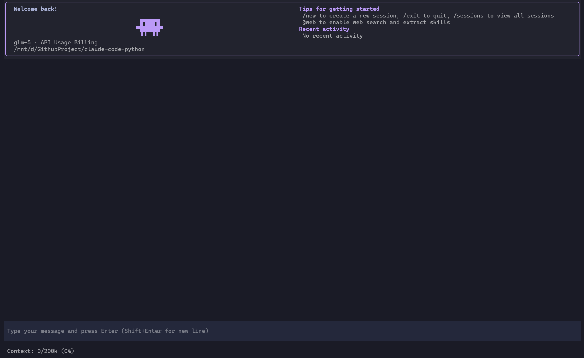

# Claude Code Python

Author: GPT-5.4 & GLM-5 & Doubao-Seed-Code-2.0

1. 此项目仅用于学习 Claude Code 基本工具调用原理，不考虑其它特性，基本不再更新。
2. 对于基于 Python 的终端 AI 编程助手，后续转向使用 [toad](https://github.com/batrachianai/toad)，一个基于 ACP 协议的通用 Python AI TUI 框架。

`claude-code-python` 是对官方 TypeScript 版 Claude Code 的 Python 3.12 重写，当前聚焦核心 agent 能力：CLI/TUI 对话循环、OpenAI 兼容 `/v1/chat/completions`、基础文件与 shell 工具，以及与上游保持一致的提示词和交互语义。

<table>
  <tr>
    <td align="center"><b>1. 欢迎界面</b></td>
    <td align="center"><b>2. 工作界面</b></td>
  </tr>
  <tr>
    <td></td>
    <td></td>
  </tr>
</table>

## 当前范围

- CLI 与 Textual TUI 两种交互模式
- 流式响应、工具调用、工具结果回填
- TUI 中每个工具调用渲染为单个可折叠块，结果返回后直接原地替换标题摘要
- 工具集：`Read`、`Write`、`Edit`、`Glob`、`Grep`、`Bash`
- OpenAI 兼容 API 接入（使用官方 OpenAI Python SDK）
- 与 TypeScript 版本对齐的系统提示词和工具描述
- **推理/思考内容支持**：支持显示模型的推理过程（如 DeepSeek 的 chain-of-thought）
- **上下文使用提示**：TUI 输入框下方显示当前上下文占用情况
- **内联 Diff 展示**：`Edit` 和 `Write` 工具结果以 diff 格式呈现，而非原始内容预览
- **多行输入支持**：Enter 提交，Shift+Enter 换行
- **输入历史**：上下键导航历史输入，持久化到 `~/.claude-code-python/input_history.json`
- **TUI Session 持久化与恢复**：每次 TUI 对话都会分配唯一 session id，记录持久化到 `~/.claude-code-python/sessions/`，支持 resume
- 针对 TUI 的无头回归测试，覆盖工具优先响应、滚动、复制和输入状态

## 安装

要求：

- Python 3.12+

开发安装：

```bash
cd claude-code-python
pip install -e ".[dev]"
```

## 配置

推荐在仓库根目录创建 `.env`：

```env
CLAUDE_CODE_API_URL=https://api.openai.com/v1
CLAUDE_CODE_API_KEY=your-api-key
CLAUDE_CODE_MODEL=gpt-4.1
CLAUDE_CODE_MAX_CONTEXT_TOKENS=128000
```

`CLAUDE_CODE_MAX_CONTEXT_TOKENS` 用于 TUI 输入框下方的上下文占用提示行，显示当前已用上下文 token 数 / 模型总上下文 token 数 / 百分比。这个值不会自动推断，需按你实际使用的模型在 `.env` 中显式填写。

也可以直接用命令行参数覆盖：

```bash
claude-code-python \
  --api-url https://api.openai.com/v1 \
  --api-key your-api-key \
  --model gpt-4.1
```

或使用简写：

```bash
cc-py \
  --api-url https://api.openai.com/v1 \
  --api-key your-api-key \
  --model gpt-4.1
```

## 运行

默认启动 TUI 模式：

```bash
claude-code-python
```

或使用简写：

```bash
cc-py
```

恢复指定 TUI session：

```bash
claude-code-python --resume <session_id>
```

通过命令行交互选择已有 TUI session：

```bash
claude-code-python --sessions
```

使用 CLI 模式：

```bash
claude-code-python --cli
```

开启调试日志：

```bash
claude-code-python --debug
```

如果同时指定了 `--log-file`，调试日志会写到指定路径；否则会自动写到当前目录下的 `.logs/claude-code-debug-<timestamp>.log`。

TUI session 说明：

- `claude-code-python`（或 `cc-py`）默认新开一个 TUI session。
- `--resume` 和 `--sessions` 只在 TUI 模式下生效，`--cli` 不支持。
- session 标题默认取首条用户消息的第一句。
- session 保存时机与 TUI 内部 rollback boundary 对齐，因此中断中的半成品响应不会污染可恢复记录。

TUI 中工具结果的显示规则：

- 每个工具调用只占一行标题，并使用单个折叠块承载参数和输出。
- 工具执行完成后，标题会从调用摘要直接更新为结果摘要，并在折叠符号后显示状态圆点，例如 `Bash: ls -la` 更新为 `● Ran: ls -la`；成功为绿色圆点，失败为红色圆点，失败标题统一采用 `Failed to ...` 形式。
- `Edit` 和 `Write` 成功后会优先显示内联 diff，隐藏原始 `old_string` / `new_string` / `content` 大字段；普通工具仍显示 `Output:` 和裁剪后的输出内容。
- `Edit` 和 `Write` 结果默认自动展开，搜索类工具标题会区分 `Glob` / `Grep` 并尽量保留匹配模式。

## 调试脚本

仓库根目录只保留产品文件，调试脚本统一收口到 `scripts/debug/debug_query.py`、`scripts/debug/diagnose_api.py`、`scripts/debug/debug_tui.py`。

用于诊断 API 连接：

```bash
python scripts/debug/diagnose_api.py
```

用于观察单次 query loop 的事件流：

```bash
python scripts/debug/debug_query.py
```

用于手动检查 TUI 布局和交互：

```bash
python scripts/debug/debug_tui.py
```

这些脚本会自动把工作目录切回仓库根目录，并优先读取根目录 `.env`。

## 目录结构

```text
claude-code-python/
├── AGENTS.md
├── README.md
├── README_EN.md
├── CHANGELOG.md
├── claude_code/
│   ├── cli.py
│   ├── core/
│   │   ├── messages.py
│   │   ├── prompts.py
│   │   ├── query_engine.py
│   │   ├── session_store.py
│   │   └── tools.py
│   ├── services/
│   │   └── openai_client.py
│   ├── tools/
│   │   ├── bash_tool.py
│   │   ├── read_tool.py
│   │   ├── write_tool.py
│   │   ├── edit_tool.py
│   │   ├── glob_tool.py
│   │   └── grep_tool.py
│   └── ui/
│       ├── app.py
│       ├── constants.py
│       ├── diff_view.py
│       ├── message_widgets.py
│       ├── screens.py
│       ├── styles.py
│       ├── utils.py
│       └── widgets.py
├── docs/
│   ├── assets/
│   │   └── tui.png
│   └── history/
│       └── rewrite_instructions.md
├── scripts/
│   └── debug/
│       ├── debug_query.py
│       ├── debug_tui.py
│       └── diagnose_api.py
└── tests/
    ├── test_cli.py
    ├── test_core.py
    └── test_tui.py
```

## 开发约定

- 以官方 TypeScript 源码为准，Python 版本不要擅自新增交互语义。
- 修改提示词、工具描述或系统 prompt 时，必须保持与 TypeScript 版一致。
- 自动化测试只放在 `tests/`，不要再在根目录添加 `test_*.py` 或 `debug*.py`。
- 调试脚本放 `scripts/debug/`，文档和截图放 `docs/`，运行日志放 `.logs/`。
- TUI 动态内容优先使用 `VerticalGroup`，不要为尚未到达的流式文本预先挂空占位。

## 测试与检查

```bash
pytest
ruff check .
black --check .
```

## 历史文档

- 初始重写任务说明已归档到 `docs/history/rewrite_instructions.md`。
- TUI 修复过程和对齐记录见 `CHANGELOG.md`。

## 许可证

MIT License
