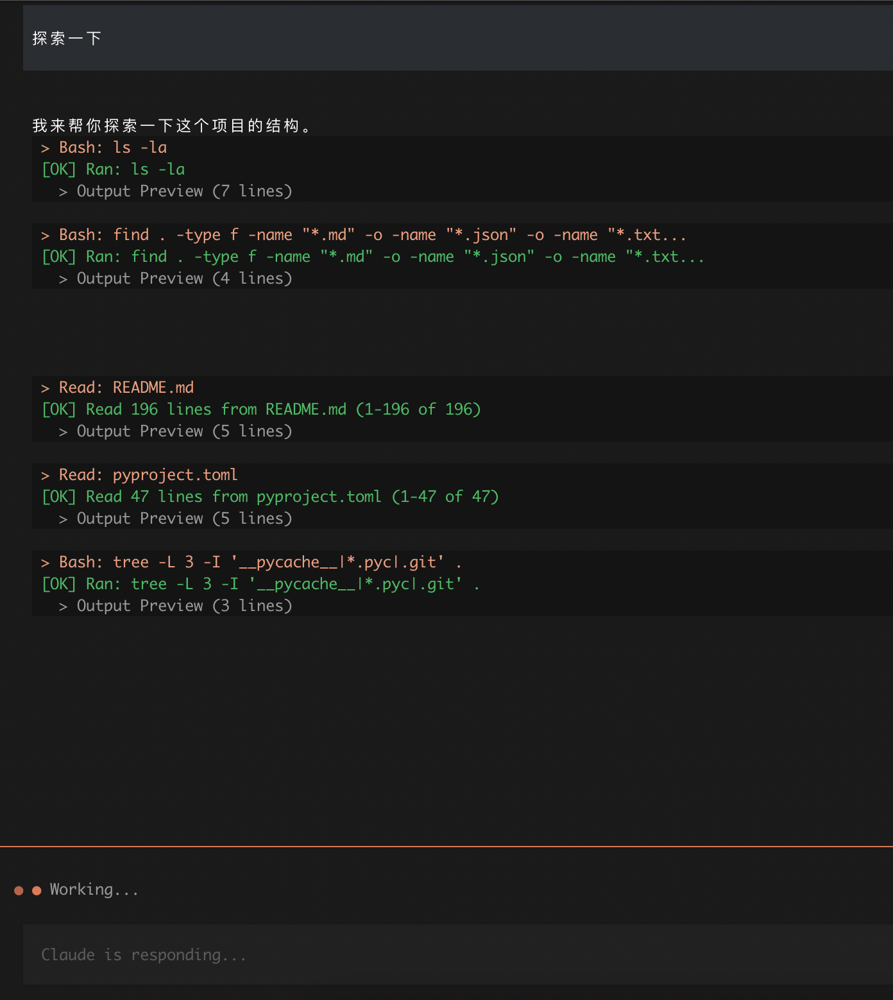

# Claude Code Python

Author: GPT-5.4 & GLM-5 & Doubao-Seed-Code-2.0

`claude-code-python` is a Python 3.12 rewrite of the official TypeScript version of Claude Code, currently focused on core agent capabilities: CLI/TUI dialogue loop, OpenAI-compatible `/v1/chat/completions`, basic file and shell tools, and prompts and interaction semantics consistent with upstream.



## Current Scope

- CLI and Textual TUI interaction modes
- Streaming responses, tool calls, tool result backfilling
- Each tool call in TUI rendered as a single collapsible block, with title summary replaced in-place when results return
- Tool set: `Read`, `Write`, `Edit`, `Glob`, `Grep`, `Bash`
- OpenAI-compatible API integration (using official OpenAI Python SDK)
- System prompts and tool descriptions aligned with TypeScript version
- **Reasoning/Thinking Content Support**: Display model reasoning process (e.g., DeepSeek's chain-of-thought)
- **Context Usage Indicator**: Shows current context usage below TUI input box
- **Inline Diff Display**: `Edit` and `Write` tool results rendered in diff format instead of raw content preview
- **Multi-line Input Support**: Enter to submit, Shift+Enter for newline
- **Input History**: Navigate history with Up/Down arrows, persisted to `~/.claude_code_history.json`
- Headless regression testing for TUI, covering tool-first responses, scrolling, copy, and input states

## Installation

Requirements:

- Python 3.12+

Development installation:

```bash
cd claude-code-python
pip install -e ".[dev]"
```

## Configuration

Recommended to create `.env` in the repository root:

```env
CLAUDE_CODE_API_URL=https://api.openai.com/v1
CLAUDE_CODE_API_KEY=your-api-key
CLAUDE_CODE_MODEL=gpt-4.1
CLAUDE_CODE_MAX_CONTEXT_TOKENS=128000
```

`CLAUDE_CODE_MAX_CONTEXT_TOKENS` is used for the context usage indicator below the TUI input box, showing current used context tokens / model total context tokens / percentage. This value is not automatically inferred and must be explicitly set in `.env` according to your actual model.

Can also be overridden with command-line arguments:

```bash
claude-code \
  --api-url https://api.openai.com/v1 \
  --api-key your-api-key \
  --model gpt-4.1
```

## Running

Default TUI mode:

```bash
claude-code
```

Use CLI mode:

```bash
claude-code --cli
```

Enable debug logging:

```bash
claude-code --debug
```

If `--log-file` is specified, debug logs will be written to that path; otherwise, they will be automatically written to `.logs/claude-code-debug-<timestamp>.log` in the current directory.

TUI tool result display rules:

- Each tool call occupies only one title line and uses a single collapsible block to hold parameters and output.
- After tool execution completes, the title updates from call summary to result summary, e.g., `Bash: ls -la` updates to `[OK] Ran: ls -la`.
- `Edit` and `Write` show inline diffs on success, hiding original `old_string` / `new_string` / `content` large fields; normal tools still show `Output:` and trimmed output content.
- `Edit` and `Write` results auto-expand by default, search tool titles distinguish `Glob` / `Grep` and preserve match patterns when possible.

## Debug Scripts

The repository root only keeps product files. Debug scripts are consolidated into `scripts/debug/debug_query.py`, `scripts/debug/diagnose_api.py`, `scripts/debug/debug_tui.py`.

For diagnosing API connections:

```bash
python scripts/debug/diagnose_api.py
```

For observing single query loop event streams:

```bash
python scripts/debug/debug_query.py
```

For manually inspecting TUI layout and interaction:

```bash
python scripts/debug/debug_tui.py
```

These scripts automatically switch working directory back to repository root and prioritize reading root `.env`.

## Directory Structure

```text
claude-code-python/
├── AGENTS.md
├── README.md
├── README_EN.md
├── CHANGELOG.md
├── claude_code/
│   ├── cli.py
│   ├── core/
│   │   ├── messages.py
│   │   ├── prompts.py
│   │   ├── query_engine.py
│   │   └── tools.py
│   ├── services/
│   │   └── openai_client.py
│   ├── tools/
│   │   ├── bash_tool.py
│   │   ├── read_tool.py
│   │   ├── write_tool.py
│   │   ├── edit_tool.py
│   │   ├── glob_tool.py
│   │   └── grep_tool.py
│   └── ui/
│       ├── app.py
│       ├── constants.py
│       ├── diff_view.py
│       ├── message_widgets.py
│       ├── screens.py
│       ├── styles.py
│       ├── utils.py
│       └── widgets.py
├── docs/
│   ├── assets/
│   │   └── tui.png
│   └── history/
│       └── rewrite_instructions.md
├── scripts/
│   └── debug/
│       ├── debug_query.py
│       ├── debug_tui.py
│       └── diagnose_api.py
└── tests/
    ├── test_cli.py
    ├── test_core.py
    └── test_tui.py
```

## Development Conventions

- Official TypeScript source code is the reference; Python version should not add new interaction semantics without authorization.
- When modifying prompts, tool descriptions, or system prompts, must maintain consistency with TypeScript version.
- Automated tests only in `tests/`, do not add `test_*.py` or `debug*.py` in root directory.
- Debug scripts go in `scripts/debug/`, documentation and screenshots in `docs/`, runtime logs in `.logs/`.
- TUI dynamic content prefers `VerticalGroup`, do not pre-mount empty placeholders for streaming text that hasn't arrived yet.

## Testing and Checking

```bash
pytest
ruff check .
black --check .
```

## History Documentation

- Initial rewrite task instructions archived in `docs/history/rewrite_instructions.md`.
- TUI fix process and alignment records in `CHANGELOG.md`.

## License

MIT License
